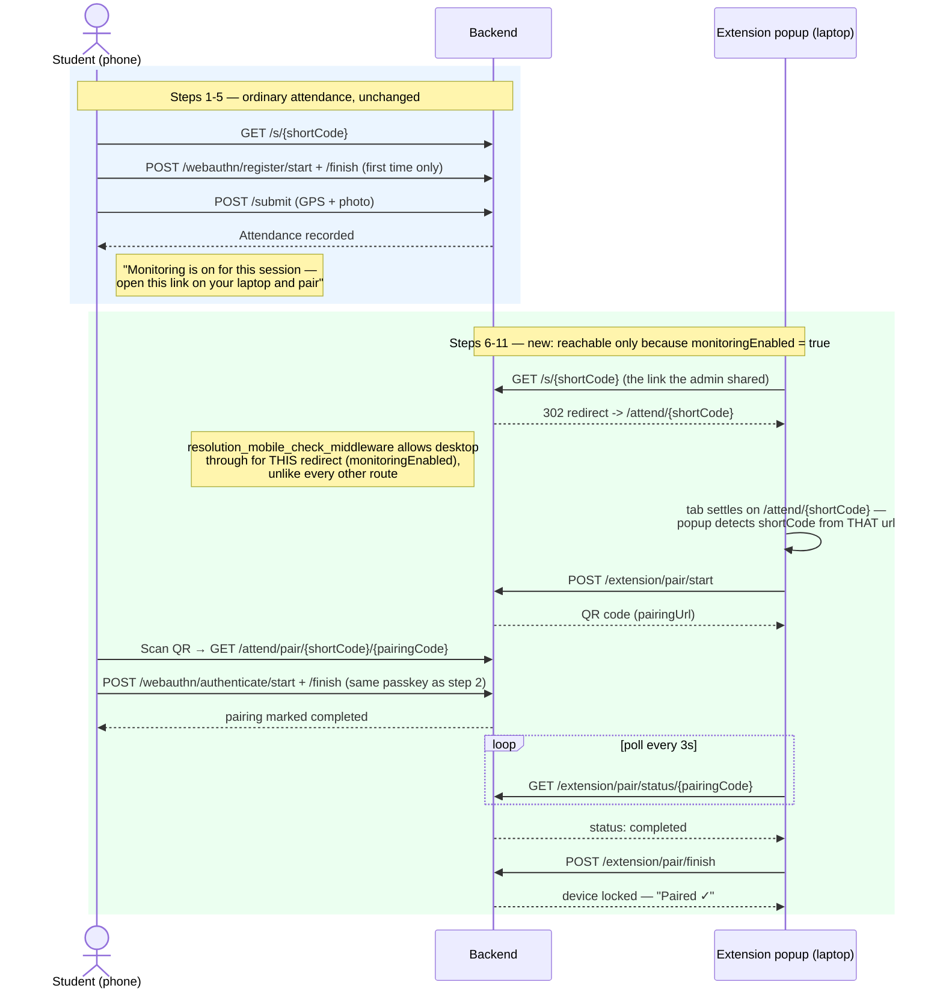
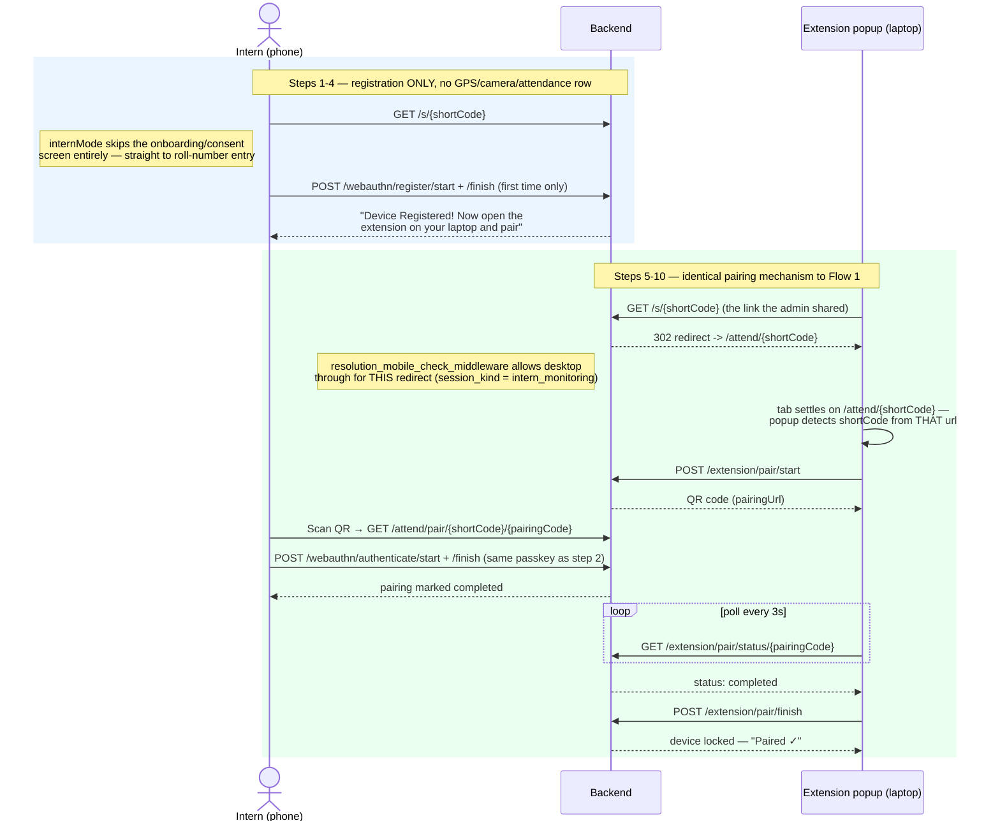

# 🖥️ Monitoring Workflow — Students & Interns

How the browser-extension monitoring feature actually works end to end, for
both kinds of sessions that support it. This is the human-readable version
of what `resolution_mobile_check_middleware`, `StudentScan.tsx`, and the
`extension/` popup do together — read this before touching any of them.

---

## The two session kinds that use monitoring

| | Ordinary session + Monitoring on | Intern-monitoring session |
|---|---|---|
| `session_kind` | `attendance` | `intern_monitoring` |
| Location / GPS | Required | None |
| Photo | Required | None |
| Attendance row created | Yes | No |
| Passkey registration | Part of the attendance flow | The *only* step on the phone |
| Extension pairing | Optional second step, after attendance | The whole point |
| Admin toggle | "Monitoring" (`monitoringEnabled`) on a Normal/Exam session | "Intern Monitoring" button on the Normal tab |

Both are driven by the exact same pairing mechanism (`extension_pairing.rs`,
`ExtensionPair.tsx`, the extension's popup). Nothing about the pairing
ceremony itself is intern-specific — the only thing that's actually
different for interns is that steps 1–3 below don't happen at all, because
there's no location to check in against.

---

## Flow 1 — Ordinary session with Monitoring on

---

## Flow 2 — Intern-monitoring session

Same pairing mechanism as Flow 1 (the green section is nearly identical in
both diagrams) — the only real difference is the blue section: no
GPS/photo/attendance-row steps at all, because there's no location on this
session to check in against.

---

## Why a laptop can open the shared link at all — and what URL it actually lands on

Every scan-flow route (`webauthn/*`, `/submit`, `/upload-url`, `/captcha`)
sits behind `mobile_check_middleware`, which hard-rejects any request that
doesn't look like a real phone — bot/automation UAs, Sec-CH-UA-Mobile
spoofing, desktop-platform-with-mobile-UA mismatches, all still enforced,
regardless of session kind. That part never changes for either flow: **a
passkey is only ever registered or authenticated from a phone.**

The two *read-only* info routes — `GET /{shortCode}` (redirect) and
`GET /{shortCode}/session` (what `StudentScan.tsx` fetches on load) — sit
behind a separate, lighter check instead:
`resolution_mobile_check_middleware`. It runs the exact same bot/spoofing
checks, but only enforces the "must be mobile" rejection when the session is
**neither** `intern_monitoring` **nor** `monitoringEnabled`. For those two
cases, a desktop browser is let through.

**Important: the tab does NOT stay on `/s/{shortCode}`.** Caddy proxies
every `/s/*` request straight to the backend (`handle /s/* { rewrite *
/api{path} }` in `Caddyfile`/`Caddyfile.prod`), and `resolve_short_link`
(`GET /s/{shortCode}`) *always* responds with a 302 to
`{PUBLIC_BASE_URL}/attend/{shortCode}` — regardless of session kind or
monitoring status. So a real browser's address bar settles on
`/attend/{shortCode}`, never `/s/{shortCode}`, by the time the extension
popup reads it. The extension's `SHORT_CODE_PATTERN`
(`extension/lib/shortCode.ts`) matches **both** `/s/{code}` (kept only as a
defensive fallback) and `/attend/{code}` — but deliberately excludes
`/attend/pair/...` (the phone-side pairing ceremony page) and
`/attend/legacy/...` (a different flow entirely), so a laptop sitting on
either of those never gets mistaken for a pairable session.

`StudentScan.tsx` picks which of three screens to show a desktop visitor
(`MobileDeviceRequired.tsx`):

- **Ordinary, unmonitored session** → "Mobile Access Required" (unchanged,
  desktop is just wrong here).
- **Intern-monitoring session** (`internMode`) → "Keep This Page Open" +
  pairing instructions. Desktop is *always* the right device here.
- **Ordinary session with monitoring on** (`monitoringMode`) → "Keep This
  Page Open" + instructions covering both cases ("if you haven't attended
  yet, use your phone; if you have, pair here") — this page has no way to
  know from a bare GET whether *this particular visitor* already attended,
  so the copy has to cover both.

---

## The extension talks to one backend, configured at build time

The extension does **not** infer its backend from whatever page happens to
be open — it only reads the *short code* from the tab URL
(`detectShortCodeFromUrl` in `extension/lib/shortCode.ts`). The
actual API origin comes from `extension/lib/config.ts`'s `API_BASE_URL`,
which is baked in at `wxt build` time from `WXT_API_BASE_URL` in
`extension/.env` (see `extension/.env.example`).

- **Local dev/testing:** `WXT_API_BASE_URL=http://localhost` (matches
  `docker-compose`'s Caddy reverse proxy and this repo's root
  `.env.example`'s `PUBLIC_BASE_URL`).
- **Production:** set it to the real deployed origin
  (`https://attendix.example.com`) before running `make build-extension` /
  `npm run build` / `npm run build:firefox`.

Rebuild the extension after changing `.env` — it's a Vite/WXT build-time
substitution, not something read at runtime.

---

## Key files

| Concern | File |
|---|---|
| Mobile-only enforcement (strict) | `backend-rust/src/middleware/mobile_check.rs` — `mobile_check_middleware` |
| Mobile enforcement (session-kind/monitoring-aware) | same file — `resolution_mobile_check_middleware` |
| Route wiring for the split above | `backend-rust/src/routes/short_link.rs` — `code_resolution_routes` vs `scan_flow_routes` |
| Session info the student page fetches | `backend-rust/src/controllers/short_link.rs` — `get_short_link_session` |
| Intern/ordinary session creation | `backend-rust/src/controllers/session.rs`, `backend-rust/src/controllers/recurring_session_rule.rs` |
| Passkey ceremonies (register/authenticate) | `backend-rust/src/controllers/public_webauthn.rs` |
| Extension pairing endpoints | `backend-rust/src/controllers/extension_pairing.rs` |
| Telemetry ingestion (post-pairing) | `backend-rust/src/controllers/telemetry.rs` |
| Student-facing page, all three modes | `frontend/student/src/pages/StudentScan.tsx` |
| Desktop "wrong device" screen, all three modes | `frontend/student/src/components/MobileDeviceRequired.tsx` |
| Phone-side pairing ceremony (QR scan target) | `frontend/student/src/pages/ExtensionPair.tsx` |
| Admin session-creation UI (both toggles) | `frontend/admin/src/pages/Sessions.tsx` |
| Extension popup (pairing UI) | `extension/entrypoints/popup/App.tsx` |
| Short-code detection from the tab URL | `extension/lib/shortCode.ts` |
| Extension background loop (periodic telemetry posts) | `extension/entrypoints/background.ts` |
| Extension's backend URL config | `extension/lib/config.ts`, `extension/.env` / `.env.example` |
| Reverse-proxy rewrite for `/s/*` | `Caddyfile`, `Caddyfile.prod` |

---

## What monitoring does and doesn't gate

`monitoringEnabled` is stored metadata (plus a computed `monitoringEndsAt`)
used by the admin UI to decide whether to show a behavior dashboard for a
session, and by `resolution_mobile_check_middleware` to decide whether a
desktop visit to the info routes is allowed. It does **not** gate pairing or
telemetry ingestion themselves — `extension_pairing.rs` and `telemetry.rs`
never check it. Mechanically, any session with an active short link can be
paired; `monitoringEnabled` only controls whether the *product* points a
student at that flow and whether the *admin* sees anything useful from it
afterward.
